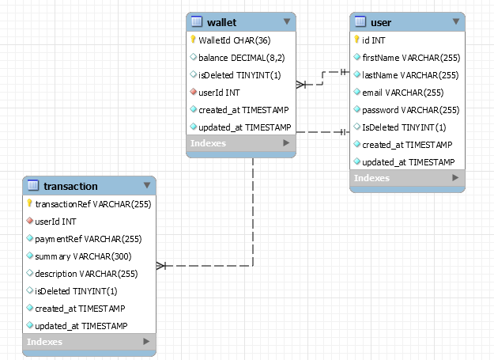

https://kareem-rahman-lendsqr-be-test.herokuapp.com

https://www.postman.com/olaitankareem01/workspace/lendsqr-be-test-api/collection/14443983-7b6ca3b9-589b-4e98-bbc7-cf8f5bb56252?action=share&creator=14443983

// README.md
# Project Support
### Introduction
   This project is a node.js api project built as lenqr backend assessment.The project was deployed on heroku and it 
   is accessible [via]: https://kareem-rahman-lendsqr-be-test.herokuapp.com
   
### Project Features
* Users can create
* Users can login
* users can fund their account
* users can transfer funds to another user’s account
* users can withdraw funds from their account.

### Installation Guide
* Clone this repository [here](https://github.com/olaitankareem01/lendsqr-be-test.git).
* The main branch is the most stable branch at any given time, ensure you're working from it.
* Run npm install to install all dependencies
* setup a mysql database for this project . 
* Create an .env file in the project root folder and set the environment variables. See sample.env for assistance.
### Usage
* Run npm start to start the application.
* Connect to the API using Postman on the port you have  specified in your .env.
### API Endpoints
| HTTP Verbs | Endpoints | Action |
| --- | --- | --- |
| POST | /v1/account/create | To create a new user account |
| POST | /v1/account/login | To login an existing user account |
| POST | /v1/account/fund | To fund an account |
| POST| /v1/account/withdraw | To withdraw from an account |
| POST| /v1/account/transfer | To transfer from one account to another |

### Database Design
	
### Technologies Used
* [NodeJS](https://nodejs.org/) This is a cross-platform runtime environment built on Chrome's V8 JavaScript engine used in running JavaScript codes on the server. It allows for installation and managing of dependencies and communication with databases.
* [ExpressJS](https://www.expresjs.org/) This is a NodeJS web application framework.
* [MongoDB](https://www.mongodb.com/) This is a free open source NOSQL document database with scalability and flexibility. Data are stored in flexible JSON-like documents.